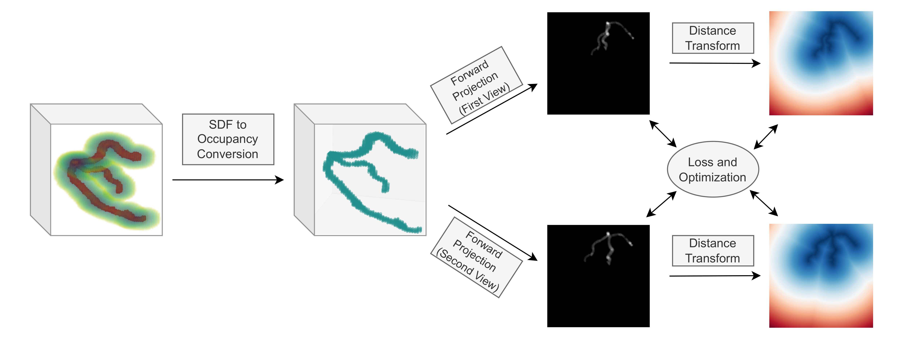
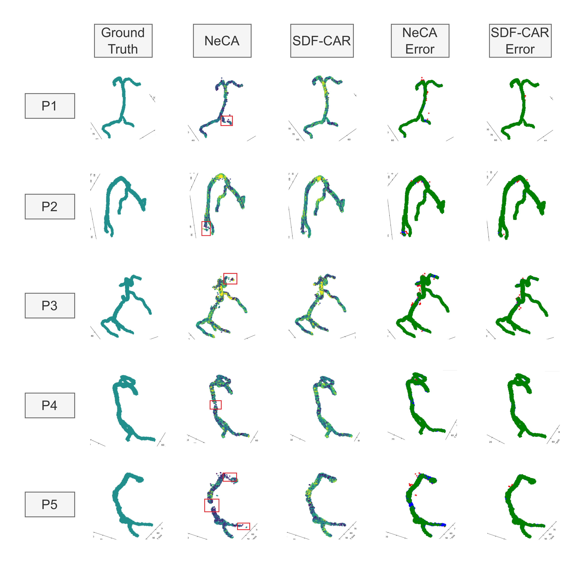
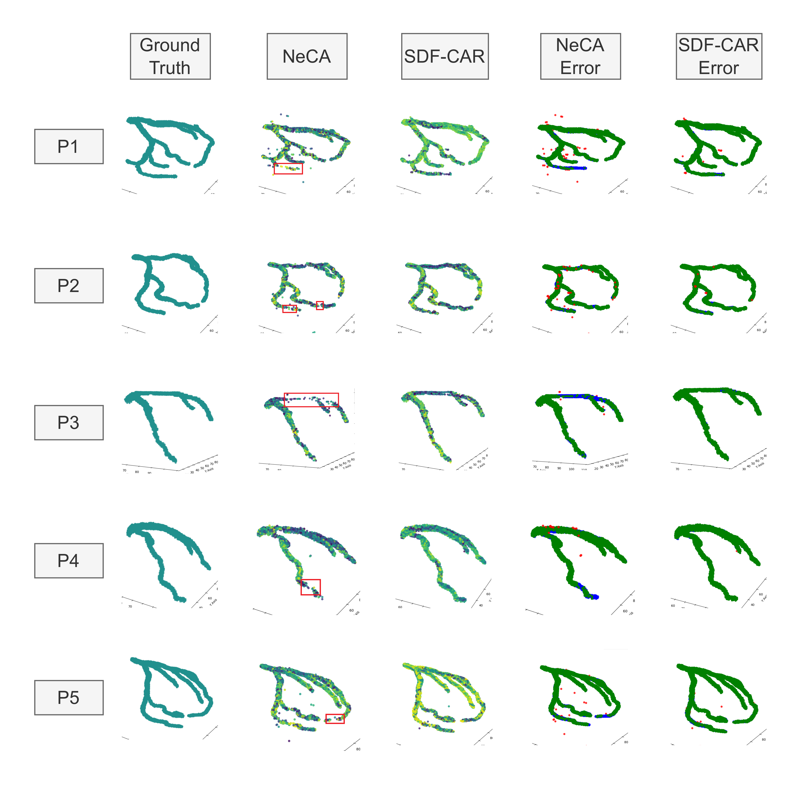

# SDF-CAR: 3D Coronary Artery Reconstruction from Two Views with a Hybrid SDF-Occupancy Implicit Representation

[](https://pytorch.org/)
[](LICENSE)

**SDF-CAR** is a novel self-supervised framework for reconstructing 3D coronary arteries from only two sparse 2D X-ray projections. By leveraging a **Hybrid SDF-Occupancy** representation, we overcome the "blobby" artifacts and broken connectivity common in pure occupancy networks (like NeCA), achieving state-of-the-art topological accuracy.

<p align="center">
  
  <br>
  <em>Figure 1: Overview of the SDF-CAR Framework.</em>
</p>

## 📄 Abstract

The three-dimensional (3D) reconstruction of coronary arteries is crucial for diagnosis but difficult to achieve from standard Invasive Coronary Angiography (ICA) which provides only sparse 2D views. We propose **SDF-CAR**, a self-supervised framework that leverages a **Signed Distance Field (SDF)**-based neural implicit representation. Unlike supervised methods that require unavailable 3D ground truth, SDF-CAR optimizes a patient-specific model directly from 2D projections. By integrating SDF-based geometric priors with an occupancy-based differentiable rendering loss, we improve the **Centerline Dice (cIDice)** score by over **16%** compared to state-of-the-art baselines, ensuring smooth, continuous vessel reconstruction.

## 🏆 Key Features

* **Hybrid Representation:** Combines the optimization stability of Occupancy networks with the geometric surface precision of Signed Distance Functions (SDF).
* **Sparse View Reconstruction:** Works effectively with only **2 standard angiographic views**.
* **Topological Preservation:** Significantly reduces broken vessel segments and disconnected branches in distal areas.
* **Self-Supervised:** No 3D ground truth required for training; optimizes directly on patient projection data.

## 📊 Qualitative Results

### Right Coronary Artery (RCA)
SDF-CAR maintains connectivity in complex curved segments where baselines often fail.

<p align="center">
  
</p>

### Left Anterior Descending (LAD)
Our method successfully captures fine distal branches that are often missed by occupancy-only methods.

<p align="center">
  
</p>

## 🛠️ Installation

This code is based on PyTorch and requires a GPU with CUDA support.

```bash
# 1. Clone the repository
git clone [https://github.com/reda1609/SDF-CAR.git](https://github.com/reda1609/SDF-CAR.git)
cd SDF-CAR

# 2. Create a conda environment
conda create -n sdf-car python=3.8
conda activate sdf-car

# 3. Install PyTorch (Adjust cuda version as needed)
conda install pytorch torchvision torchaudio pytorch-cuda=11.8 -c pytorch -c nvidia

# 4. Install dependencies
pip install -r requirements.txt

# 5. (Optional) Install tiny-cuda-nn for hash encoding acceleration
pip install git+[https://github.com/NVlabs/tiny-cuda-nn/#subdirectory=bindings/torch](https://github.com/NVlabs/tiny-cuda-nn/#subdirectory=bindings/torch)
```

## 📂 Data Preparation

We utilize the **ImageCAS** dataset (Coronary Artery Segmentation from CCTA).

1.  Download the ImageCAS dataset.
2.  Preprocess the data to generate Digital Reconstructed Radiographs (DRRs) for training.
3.  Organize data as follows:

    ```
    data/
    ├── ImageCAS/
    │   ├── patient_01/
    │   │   ├── proj_1.png
    │   │   ├── proj_2.png
    │   │   └── geometry.json
    │   └── ...
    ```

## 🚀 Usage

### Training
To optimize a model for a specific patient (e.g., Patient 1 RCA):

```bash
python train.py --config configs/rca.yaml --patient_id 1 --gpu 0
```

### Evaluation
To evaluate the reconstruction against Ground Truth (if available for validation):

```bash
python eval.py --checkpoint experiments/patient_1/best_model.pth --output_dir results/
```

## 📝 Citation

If you find this code or paper useful for your research, please cite:

```bibtex
@article{yourname2025sdfcar,
title={SDF-CAR: 3D Coronary Artery Reconstruction from Two Views with a Hybrid SDF-Occupancy Implicit Representation},
author={Your Name and Co-Authors},
journal={Submission Target},
year={2025}
}
```

## 🙏 Acknowledgements

This code heavily builds upon the following excellent repositories:

* [NeCA](https://github.com/SID-CoroRecon/NeCA)
* [Instant-NGP](https://github.com/NVlabs/instant-ngp)
* [ImageCAS Dataset](https://github.com/XiaoweiXu/ImageCAS-A-Large-Scale-Dataset-and-Benchmark-for-Coronary-Artery-Segmentation-based-on-CT)

---
*For questions, please contact [your.email@university.edu].*